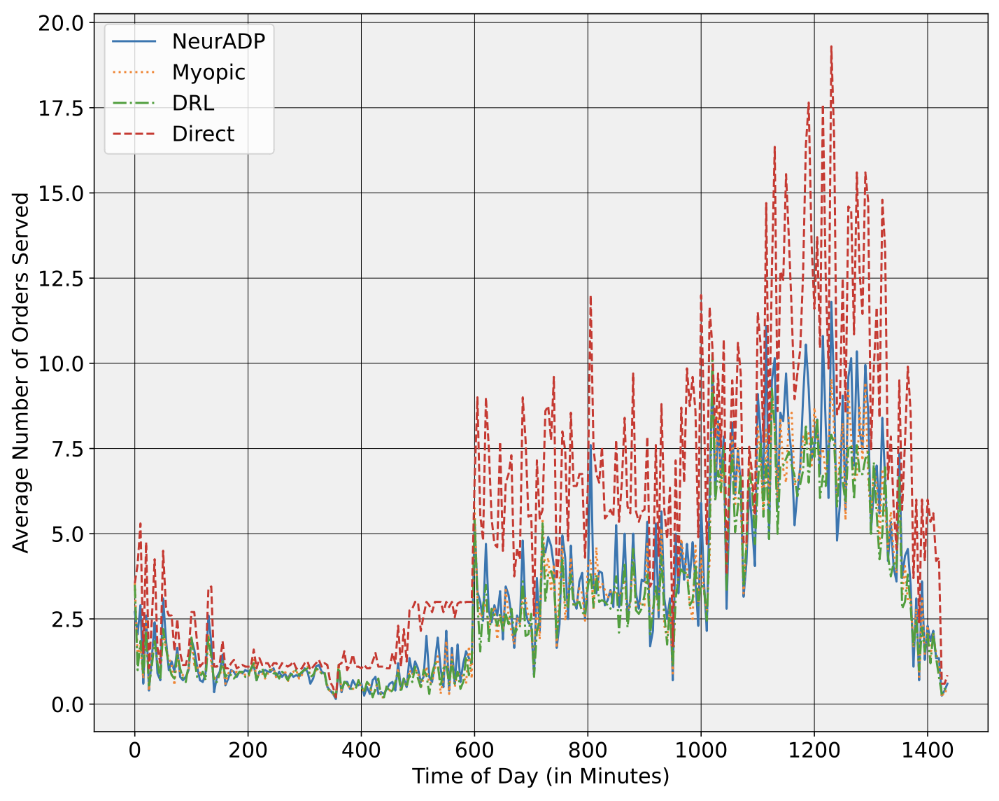

# NeurADP for Ultra-fast Order Dispatching

This repository provides complementary code and data for the article [Neural Approximate Dynamic Programming for the Ultra-fast Order Dispatching Problem](https://arxiv.org/pdf/2311.12975.pdf).  Datasets derived and used for the paper may be found [here](https://drive.google.com/drive/folders/1GiQBBNMlfUW1VdysZcVVXKtdx9SZqJrd).

This paper tackles the challenges of same-day delivery, focusing on order dispatching and matching. It builds on existing research by introducing new features like batching and courier queues for more realistic dispatching, and expanding the problem scope to include larger-scale operations. The study applies a [NeurADP](https://arxiv.org/pdf/1911.08842.pdf) solution approach to the ultra-fast order dispatching problem, showcasing its effectiveness against traditional and DRL baselines. It also introduces specific datasets for order dispatching and evaluates solution quality through artificial bounds and sensitivity analysis. Overall, it advances the understanding and methods in order dispatching and same-day delivery, offering insights for practitioners and future research.



## Repository Structure
* `data` - Files related to datasets and generating instances of order arrivals. 
	* `prepare_data.py` - Create order instances and initialise data preparation. 
	* `DataGenerator.py` - Class to generate simulated data for orders.
	* `RequestOrder.py` - Class representing a request order.
	* `datasets` - Original cleaned datasets used to generate instances.
	* `generations` - Data generation objects stored for use.
* `src` - Contains main set of code for running simulations.
	* `run.py` - Main code for running simulations and defining parameters.
	* `CentralAgent.py` - Central agent class to handle matching orders & agents.
	* `Environment.py` - Environment class in which agents operate.
	* `LearningAgent.py` - A class representing a learning agent (courier).
	* `RequestOrder.py` - Class representing a request order.
	* `DataGenerator.py` - Class to generate simulated data for orders.
	* `Experience.py` - Class representing an experience in simulation.
	* `ValueFunction.py` - NeurADP NN class for training and decision making.
	* `ReplayBuffer.py` - Replay buffer used in training.
	* `segment_tree.py` - Segment tree structure used in training.
	* `ResultCollector.py` - Class for collecting results from simulation.
* `Results` - Used for storing the outcomes of simulations.
* `plots` - Figures relating to experiment results.
* `requirements.txt` - Requirements file for installation.

## Simulation Parameters
There are several variables which may be tuned when running the simulations. Below I provide a table of the parameter, their description, the default value, and the choices.

| Parameter | Description | Data Type | Default | Choices |
|--------------|-------------|-------------|-------------|-------------|
|***n***|Number of couriers|***int***|15|[10,15,20]|
|***data***|City used in simulation|***str***|Brooklyn|[Brooklyn, Chicago, Iowa, Bangalore]
|***shift_length***|Duration of courier shifts|***int***|6|[1,2,...,24]
|***dt***|Maximum allowed delay time|***float***|10.0| *any*
|***vehicle_cap***|Maximum allowed vehicle capacity|***int***|3|[0,1,2...]|
|***train_days***|Number of training days used|***int***|60|*any*|
|***test_days***|Number of testing days used|***int***|20|*any*||

## Installation and Execution Setup
In the following, I will describe how to setup a conda environment, initialise python, download CPLEX, and install necessary packages for setting up the repository in a virtual machine.
### (1) Install Conda
```bash
wget https://repo.anaconda.com/archive/Anaconda3-2021.11-Linux-x86_64.sh
``` 
```bash
bash Anaconda3-2021.11-Linux-x86_64.sh
```
### (2) Create & Access Virtual Environment
Create enviornment named ***adp*** that has ***python 3.6.13*** installed
```bash
conda create -n adp python=3.6.13
```
```bash
conda activate adp
```
### (3) Download Java VM
Download Java Virtual Machine
```bash
sudo apt-get update
```
```bash
sudo apt-get install default-jdk
```
```bash
java -version
```
### (4) Download CPLEX
Visit [CPLEX website](https://www.ibm.com/ca-en/products/ilog-cplex-optimization-studio) and login using an academic/professional account. Download IBM ILOG CPLEX Optimization Studio bin file called ***cplex_studio1210.linux-x86-64.bin***.
Then you may upload the bin file to your VM and run the following commands:
```bash
chmod +x cplex_studio1210.linux-x86-64.bin
```
```bash
mkdir CPLEX
```
```bash
./cplex_studio1210.linux-x86-64.bin
```
When asked during installation where to setup CPLEX, you may provide the path to your CPLEX folder:
```bash
/PATH/TO/CPLEX
```
Finally, you may setup CPLEX via the following:
```bash
python CPLEX/python/setup.py install --user
```
### (5) Install Necessary Packages
You may run the `requirements.txt` file provided via:
```bash
pip install -r requirements.txt
```
Conversely, you may manually install the necessary packages via:
```bash
pip install Keras==2.2.4
pip install pandas==1.1.5
pip install numpy==1.19.5
pip install matplotlib==3.3.4
pip install tensorflow==1.15.0
pip install tqdm
pip install networkx
```

## Citing this Work
To cite this work, please use the following:
```bash
@article{dehghan2023neural,
  title={Neural Approximate Dynamic Programming for the Ultra-fast Order Dispatching Problem},
  author={Dehghan, Arash and Cevik, Mucahit and Bodur, Merve},
  journal={arXiv preprint arXiv:2311.12975},
  year={2023}
}
```
